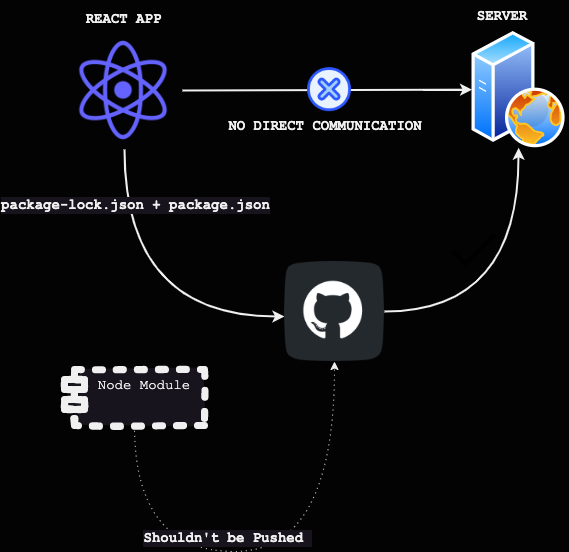

# Igniting our App

## What are Bundlers?

Bundler refers to a tool that packages the code and its dependencies into a single bundle and then loads it to the browser.

`parcel`, `vite`, and `webpack` are **bundlers**

We will use `parcel` as a bundler.

If we want to manage some packages we need a package manager one such package manager is `npm` alternative to npm is `yarn`

## `npm` setup process

Why do we need npm?

Our react app just can't be made up of injecting react into the directory, there are various other packages we needed to build the react app. It is required to manage the packages which make our app production ready.

If you want npm in your app we just do `npm init` means **initialize**

- This will create a package.json and will store all the dependencies and metadata of the app

When we run `npm init` in the terminal You will be prompted to enter information such as the name and version of your project, as well as the dependencies that your project requires.

Here is the setup :


You can skip this by running `npm init -y`

The `npm init -y` command is a shortcut for the npm init command that s**kips the interactive prompt and creates a package.json file with default values.**

When you run `npm init -y`, a **package.json** file will be created in the current directory with the following default values:

```zsh
name: the name of the current directory
version: 1.0.0
description: an empty string
entry point: index.js
test command: an empty string
git repository: an empty string
keywords: an empty array
author: an empty string
license: ISC
You can edit the package.json file to add or modify the values as needed.
```

Note that the `-y` flag is a shortcut for the `--yes` flag, and it can be used to skip the interactive prompt for any npm command that has an interactive prompt.

Successfully initialized npm into the root folder 🥳 🎉

## Installation of [parcel](https://parceljs.org/)

We write `npm install` to install a package.

`npm install -D parcel`
OR
`npm install --save-dev parcel`

What is `-D`?

`-D` means Dev dependency. Any package we don't want to make available on production we only want in the developer machine so we use` -D` or `--save--dev`

Are `-D` and `--save-dev same`?

Yes, both `-D` and `--save-dev` are the same.

> devDependency means we need a parcel in our dev environment.

As soon as the parcel is installed we get new files

- package-lock.json
- node_modules


<br>

What is this `package-lock.json`?

Suppose we are using a package of version "^2.8.2" and in the future the package upgrades now since we have used `^` this means it will adapt the upgraded versions and now the package-lock.json **will track what exact version you use.**

> It locks the version
>
> Never keep `package-lock.json` in .gitignore
>
> It also has sha512 which ensures integrity and ensures that it is the same version on the developer's machine and production.
>
> Node Modules should not be in git! put in .gitignore, we can regenerate node_modules with the help of package-lock.json on the server.

Our app has a dependency on the `parcel`, it also has a dependency on the other packages which are stored in `node_modules`

<div align = "center">



</div>

## Installation of React

We know we can inject React using `CDN` which is quite tedious and it is also easier to fetch react from our server rather than CDN.

Installing **react**

``` shell
npm i react
```

Installing **react-dom**

``` shell
npm i react-dom
```

Note: **i** == **instal**


## Igniting our App

We will ignite our app with the help of parcel with the command:

Syntax:

``` shell
npx parcel entry point
```

run:

``` shell
npx parcel index.html
```