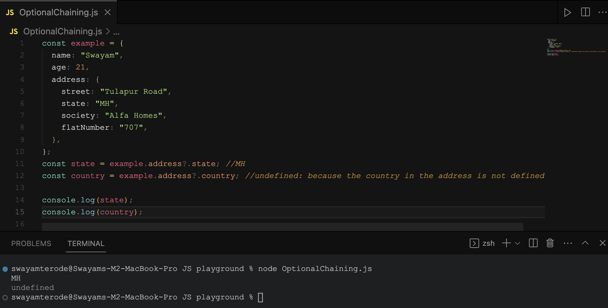

# Chapter 6 - Exploring the World!

## What is Monolith architecture?

- All components of the application, including the `user interface`, `business logic`, etc are built and deployed as a single application.
- It is usually easy to deploy and develop as all the components are packed together and deployed as a single Unit.
- It may also lead to several issues such as scalability issues, and difficulty in maintaining the codebase as all the files are in the same folder/repo.

## What is the difference between Monolith and Microservices?

- In Monolith all components of the application are built and deployed as a single application.

- In microservices, the single application is divided into various small chunks such as `UI`, `Payment Processing`, `auth`, etc. It is easier to maintain the codebase, it's more scalable.

## Why do we need useEffect?

- It allows us to manage the component side effects such as `fetching the API`, `subscribing to events`, or manipulating the `DOM`.
- Updating the component state

useEffect( ) accepts two arguments: `callback function` and `dependency array`.

```js
useEffect(() => {
  // .
  // .
  // .
  // .
  // .
}, []);
```

The `() => {}` is a callback function and `[]` is called an empty dependency array. If anything that we pass (suppose currentState) inside the `[]` it triggers the callback function and changes the state of the application.

```jsx
useEffect(() => {
  setCurrentState("true");
}, [currentState]);
```

If we do not pass an empty dependency array then the useEffect runs whenever the UI is rendered.

```jsx
useEffect(() => {});
```

## What is optional chaining?

- Optional Chaining is the JavaScript feature that allows us to access the properties or the methods of the object.

- It is represented by the question mark symbol `?` and can be used with the combination of the `.` or bracket notation `[]`.

See the example 👇



## What is Shimmer UI?

- It is just a skeleton of the component which will load when there are any UI changes or any state changes.

- Shimmer UI is designed to improve the user experience by reducing load time.

- Overall, Shimmer UI is a useful technique for improving the user experience of web applications by providing visual feedback during content loading. It helps to reduce user frustration and prevent users from leaving the application due to long load times or lack of feedback.

## What is the difference between JS expression and JS statement

In general, expressions are used to compute values or return values from functions, while statements are used to control the flow of a program and perform actions.

## What is Conditional Rendering?

- `Conditional rendering` in React works the same way conditions work in `JavaScript`. Use JavaScript operators like `if` or the `conditional operator` to create elements representing the current state, and let React update the UI to match them. for example:

```js
// Using the Ternary operator as a shorthand way of writing an if-else statement
{isLoggedIn ? (return <UserGreeting />) : (return <GuestGreeting />)};
// Using an if…else Statement
{
  (if (isLoggedIn) {
    return <UserGreeting />;
  }else {
    return <GuestGreeting />;
  })
}
// Using Logical &&
{isLoggedIn && <button>Logout</button>}
```

## What is CORS?

- Cross-Origin Resource Sharing (CORS) is an HTTP-header-based mechanism that allows a server to indicate any origins (domain, scheme, or port) other than its own from which a browser should permit loading resources. CORS defines a way in which a browser and server can interact to determine whether it is safe to allow the cross-origin request.

## What is async await?

- `Async`: It simply allows us to write promises-based code as if it was synchronous and it checks that we are not breaking the execution thread. It operates asynchronously via the event loop. Async functions will always return a promise. It makes sure that a promise is returned and if it is not returned then JavaScript automatically wraps it in a promise which is resolved with its value.
- `Await`: Await function is used to wait for the promise. It could be used within the async block only. It makes the code wait until the promise returns a result. It only makes the async block wait.

  for example:

```jsx
// async function getRestaurant to fetch Swiggy API data
async function getRestaurants() {
  const data = await fetch("Swiggy_API_URL");
  const json = await data.json();
  // we get the Swiggy API data in json format
  console.log(json);
}
```

## What is the use of const json = await data.json(); in getRestaurants()?

- The data object, returned by the `await fetch()`, is a generic placeholder for multiple data formats. so we can extract the JSON object from a fetch response by using await `data.json(). data.json()` is a method on the data object that lets you extract a JSON object from the data or response. The method returns a promise because we have used await keyword. so `data.json()` returns a promise resolved to a `JSON` object.
