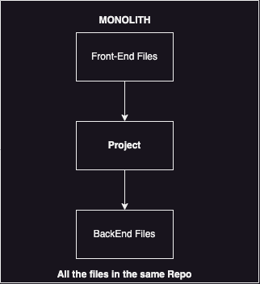
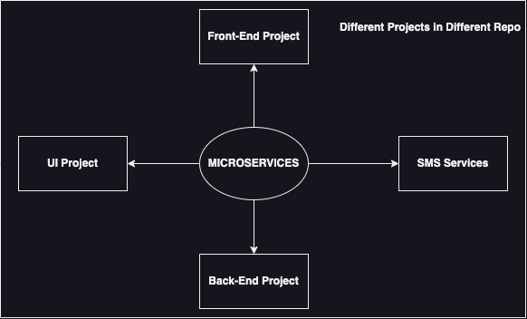
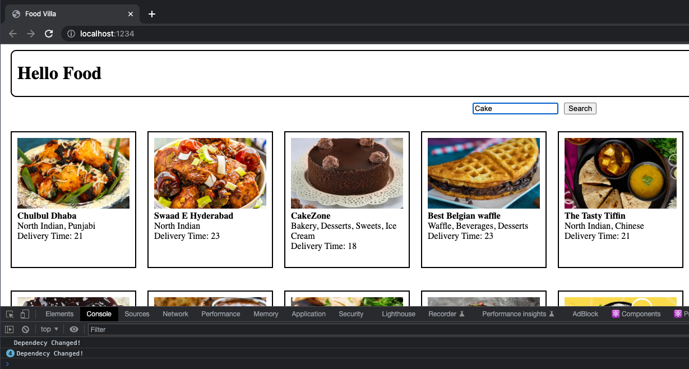
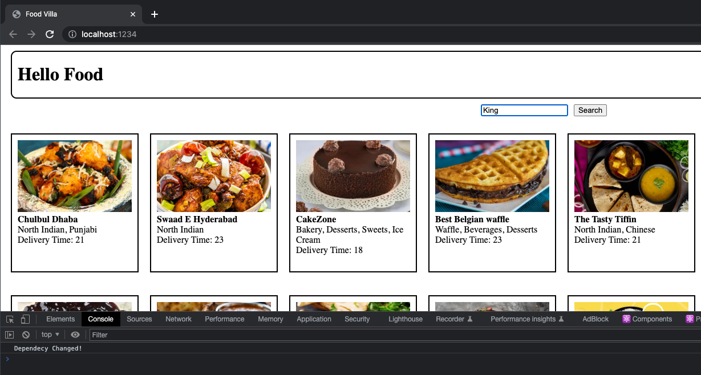

# Chapter 6: Exploring the World 🗺️

## Microservices

When we have to build a large project there are many microservices that together built the project.

**`Monolith`** has all the files inside the single repo i.e one project.

**`Microservices`** divides its file into a small projects.

Advantages of Microservice

- Seprartion of concern.
- Easy to maintain.
- If you have to commit changes on Back-End no need to fetch the UI project.
- Easy to test.
- Microservices depend on the use case.

Monolith 👇



MICROSERVICES 👇



They are different projects so there will be deployed on different ports, but this port will have all the common **DOMAIN name** so this way they all are connected.

But some companies also change their Domain name so the `API` comes from [api.github.com](#).

<!--
How these applications are connected?

The different microservices are deployed on different port numbers it is -->

## Two ways to load the website:

First method:

```js
LOADS => API (takes 300ms) => Render the PAGE(200ms)

Not a good practice 👎
```

Second Method:

```js
LOADS =>Render the PAGE(200ms) => API (takes 300ms)

Good practice 👍
```

We will be working on the second method because it is a good practice.

There are two ways when site renders:

1. When `state` changes.
2. When `props` changes.

### `useEffect()`

It is just a Hook (normal function). It comes from React Library, imported as a named import.

**The main use of the useEffect()** 🤔 ?

- Suppose we render the page and then with the help of API we update the UI a lot of time is saved.

`use effect ( )` has two parameters, `Callback function` and `dependency array`.

A callback function is called in every rerender but if you don't want to rerender again and again then can pass an _empty_ `dependency array`.

- If the `callback function` is **not** dependent on the `dependency array` then it will just be called **ONCE** 👍

**Example of dependency array:**

Whenever the dependent variable is changed the callback function is rerendered. This shows the variable is dependent on the changes it sees.

```jsx
const [restaurants, setRestaurants] = useState(restaurantList);
const [searchText, setSearchInput] = useState("");

useEffect(() => {
  console.log("Dependecy Changed!");
}, [searchText]);
```



In the above example, whenever the searched text is changed the callback function will be called and then it will be reflected on the console.

**Example of empty dependency array**:

The callback function will be called whenever the search text changes.

```jsx
useEffect(() => {
  console.log("Dependecy Changed!");
}, []);
```

This means this is not dependent on any component.



As you can see the searched text is `King` but in the console it did not rerender ✅

`UseEffect ()` will be called just after every element is rendered because it has a callback function.
